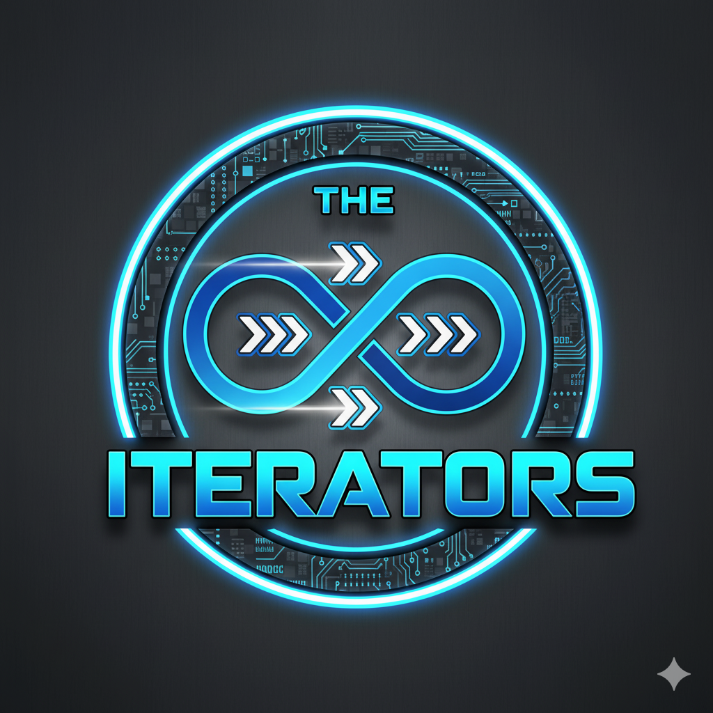

# Final project

**Course**: `Python Programming: Foundations and Best Practices 2.0`

**Group**: `SEAI-1 / Group 9`

**Application**: `Personal assistant`

**Team**: `The Iterators`

**App name**: `Persyval`

[//]: # ""
[//]: # ''
[//]: # ""
[//]: # ''

<!--suppress CheckImageSize -->

 

---

# Install

For end-users.

Note: For developers, see the [Dev](#dev) section.

## Uv install or update

You need this for both usage and development.

https://docs.astral.sh/uv/getting-started/installation/

On Windows it can be better to use `Git Bash` terminal.

```bash
if ! command -v uv &> /dev/null; then
    curl -LsSf https://astral.sh/uv/install.sh | sh;
else
    uv self update;
fi

uv --version
```

## Install or update a project for system-wide usage

Run it from any directory, except the project directory.

```shell
if ! command -v persyval &> /dev/null; then
    uv tool install git+https://github.com/Alirex/pycore-i-final-i-seai-1-g-9
else
    uv tool upgrade persyval
fi
```

Dev installation: [see here](#install-app-system-wide-in-development-mode)

## Check that project in the list

```shell
uv tool list --show-python
```

## Remove the project with all data

If you need to remove the project with all data, run this command from the project directory:

```shell
persyval helpers clear-storage &&\
uv tool uninstall persyval
```

---

# Usage

## Run the chat

After installation, you can run the chat from any directory.

```shell
persy
```

Chat is interactive. With autocompletion in some cases.

## Extra features

Some extra features are available.

For example, you can run the same chat as in shorthand, but by this:

```shell
persyval chat run
```

or see which folders are used by the app:

```shell
persyval helpers show-paths
```

### CLI help

Help for non-interactive CLI mode:

[See here](docs/cli_help.md)

Also, available via commands:

```shell
persyval --help
```

or

```shell
persyval helpers --help
```

etc.

### Install CLI completion (Optional)

This will install completion for the current shell. Available after restarting the shell.

```shell
persyval --install-completion
```

Note: relatively safe to run multiple times. It just adds extra newlines to your shell config when run multiple times.

---

# Dev

## Docs

Here you can read some [docs](docs).

Here is a [project code conventions](docs/conventions.md).

## Dev deployment

### Install uv

Install uv for development.

Use command from the [previous section](#uv-install-or-update).

### Ruff install or update

Install ruff for manual linting, if needed.

https://docs.astral.sh/ruff/installation/

```bash
if ! command -v ruff &> /dev/null; then
    uv tool install ruff
else
    uv tool upgrade ruff
fi

ruff --version
```

### Install pre-commit

Needed for automatic linting.

```shell
if ! command -v pre-commit &> /dev/null; then
    uv tool install pre-commit
else
    uv tool upgrade pre-commit
fi

pre-commit --version
```

### Clone the repository

Make this if you haven't done it yet.

### Create venv

Make this in the project directory.

```bash
uv sync --all-packages
```

It must be used automatically in the IDE (PyCharm, VSCode).

It will be used automatically without manual activation with command like `uv run something`.

### Register pre-commit hooks

Make this after cloning the repository.

```shell
pre-commit install
```

Make this each time after cloning the repository.

Don't need to do it after changing the hooks, commit or pull.

### Run pre-commit hooks

If needed, run them manually.

```shell
pre-commit run --all-files
```

Useful after changing the hooks. Or just to check if everything is fine.

### Install app system-wide in Development mode

For system-wide usage during development, run this command from the repository directory:

```shell
uv tool install --editable .
```

### Run the app

Go to the [Usage](#usage) section. Check some commands.

### Run demo

Run a script with some demo interactions.

```shell
bash ./src/persyval/tests/demo_interaction.sh
```

Details: [script](./src/persyval/tests/demo_interaction.sh)

### Run tests

All tests:

```shell
uv run pytest
```

Or run some group by **k**eyword in verbose mode:

```shell
uv run pytest --verbose -k test_birthday
```

Keyword can be any part of the test name. For example, the name of a file, or function.

### Check code quality

```shell
uv run poe quality
```

### Clear data

```shell
persyval helpers clear-storage
```

### Generate some data

```shell
persyval helpers fill-storage --init-only --amount 30
```

## Interesting locations

- [main chat function](./src/persyval/services/chat/main.py)
  - Root of many interactions by chat.
- [commands](./src/persyval/services/commands)
  - Add new commands with related information here.
- [handler base class](./src/persyval/services/handlers_base/handler_base.py)
  - See hook-based lifecycle for handlers.
- [handlers implementations](./src/persyval/services/handlers)
  - Implement new handlers here. Connect to command.
- [models](./src/persyval/models)
  - Classes with important entities.
- [data storage](./src/persyval/services/data_storage/data_storage.py)
  - Contains data of the app.
- [data actions](./src/persyval/services/data_actions)
  - Actions with data.
- [tests](./src/persyval/tests)
  - Tests.

---

## Extra

- Why is the `.idea` folder is partially stored in the repository?
  - [read (UKR)](https://github.com/Alirex/notes/blob/main/notes/ignore_or_not_ide_config/ukr.md)
- Why `py.typed`?
  - [mypy (ENG)](https://mypy.readthedocs.io/en/stable/installed_packages.html#creating-pep-561-compatible-packages)
  - [typing (ENG)](https://typing.python.org/en/latest/spec/distributing.html#packaging-type-information)

### Create a new project

In case, if you need to create a new project with `src-layout` instead of default, created by PyCharm,
use the following command inside the project directory:

```shell
rm --recursive --force src pyproject.toml &&\
uv init --package --vcs none &&\
touch src/$(basename $PWD | tr '-' '_')/py.typed &&\
uv sync
```
