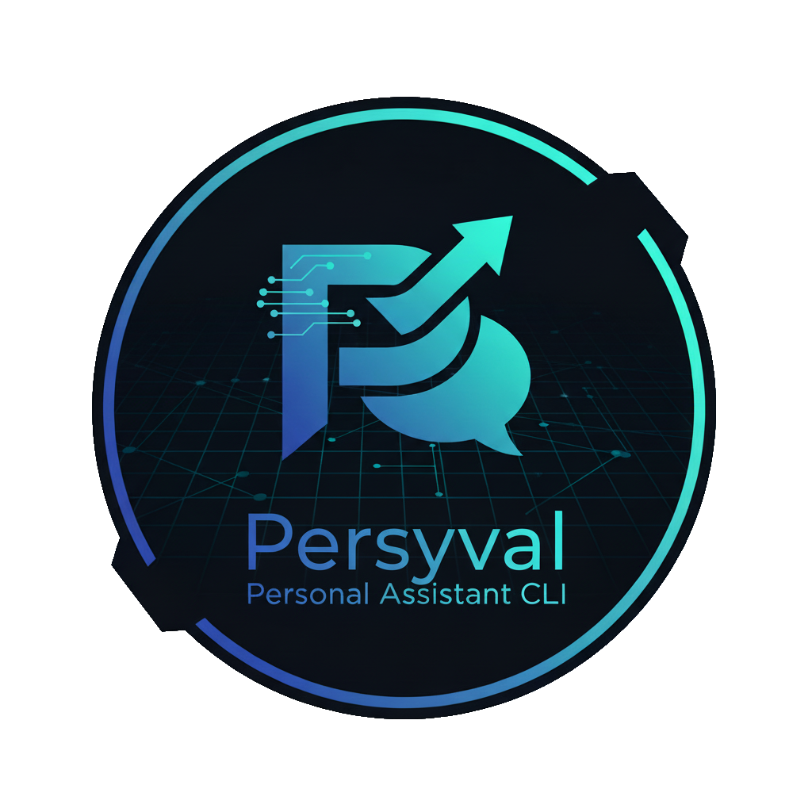

# Final project

Course: "Python Programming: Foundations and Best Practices 2.0"

Group: "SEAI-1 / Group 9"

Application: "Personal assistant"

Codename: "Persyval"



---

## Usage:

Run from the project:

```shell
uv run persyval chat run
```

Run after installation:

```shell
persyval chat run
```

or use a short command to access the chat.

```shell
persy
```

### CLI help

Help for non-interactive CLI mode:

[See here](docs/cli_help.md)

### Install CLI completion

This will install completion for the current shell. Available after restarting the shell.

```shell
persyval --install-completion
```

Note: relatively safe to run multiple times. It just adds extra newlines to your shell config when run multiple times.

---

## Install

### Uv install or update

You need this for both usage and development.

https://docs.astral.sh/uv/getting-started/installation/

```bash
if ! command -v uv &> /dev/null; then
    curl -LsSf https://astral.sh/uv/install.sh | sh;
else
    uv self update;
fi

uv --version
```

### Install or update a project

```shell
if ! command -v persyval &> /dev/null; then
    uv tool install git+https://github.com/Alirex/pycore-i-final-i-seai-1-g-9
else
    uv tool upgrade pycore-i-final-i-seai-1-g-9
fi
```

Note: You can change the url to something like this if the repository is private:

- git+ssh://your-ssh-config-profile/Alirex/pycore-i-final-i-seai-1-g-9

Or, for development, change the installation command to:

```shell
uv tool install --editable .
```

And run it from the repository directory.

### Remove project

```shell
uv tool uninstall pycore-i-final-i-seai-1-g-9
```

### Check project in the list

```shell
uv tool list --show-python
```

---

## Dev

### Docs

Here you can read some [docs](docs).

Here is a [project code conventions](docs/conventions.md).

### Ruff install or update

https://docs.astral.sh/ruff/installation/

```bash
if ! command -v ruff &> /dev/null; then
    uv tool install ruff
else
    uv tool upgrade ruff
fi
```

### Create venv

```bash
uv sync --all-packages
```

### Register pre-commit hooks

```shell
pre-commit install
```

### Run pre-commit hooks

```shell
pre-commit run --all-files
```

---

## Extra

- Why is the `.idea` folder is partially stored in the repository?
  - [read (UKR)](https://github.com/Alirex/notes/blob/main/notes/ignore_or_not_ide_config/ukr.md)
- Why `py.typed`?
  - [mypy (ENG)](https://mypy.readthedocs.io/en/stable/installed_packages.html#creating-pep-561-compatible-packages)
  - [typing (ENG)](https://typing.python.org/en/latest/spec/distributing.html#packaging-type-information)

### Create a new project

In case, if you need to create a new project with `src-layout` instead of default, created by PyCharm,
use the following command inside the project directory:

```shell
rm --recursive --force src pyproject.toml &&\
uv init --package --vcs none &&\
touch src/$(basename $PWD | tr '-' '_')/py.typed &&\
uv sync
```
